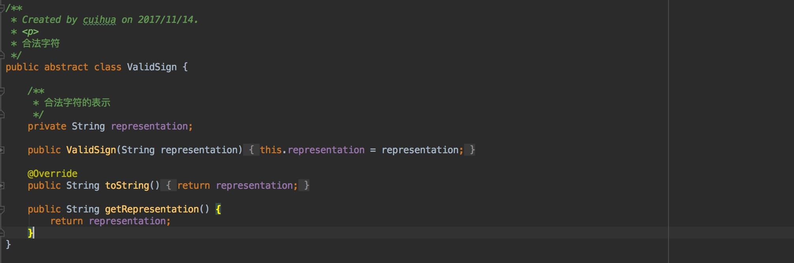
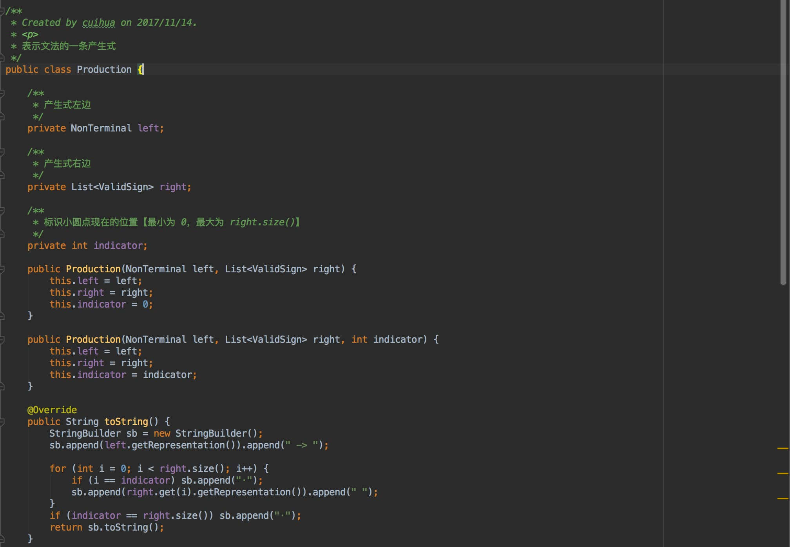
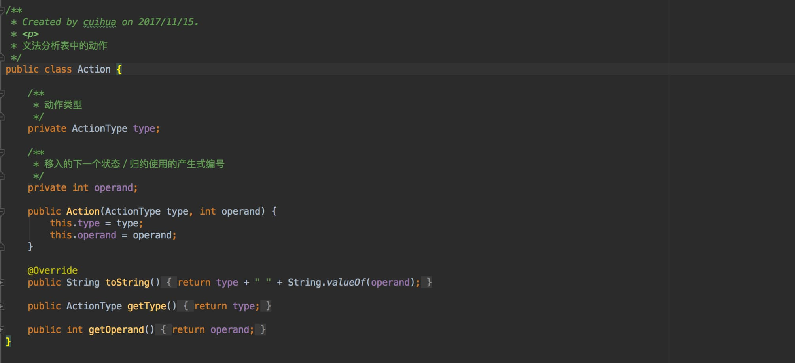
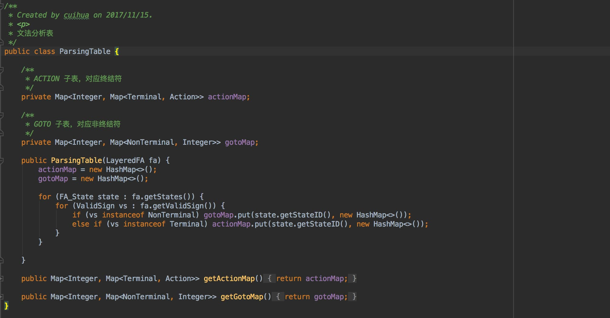
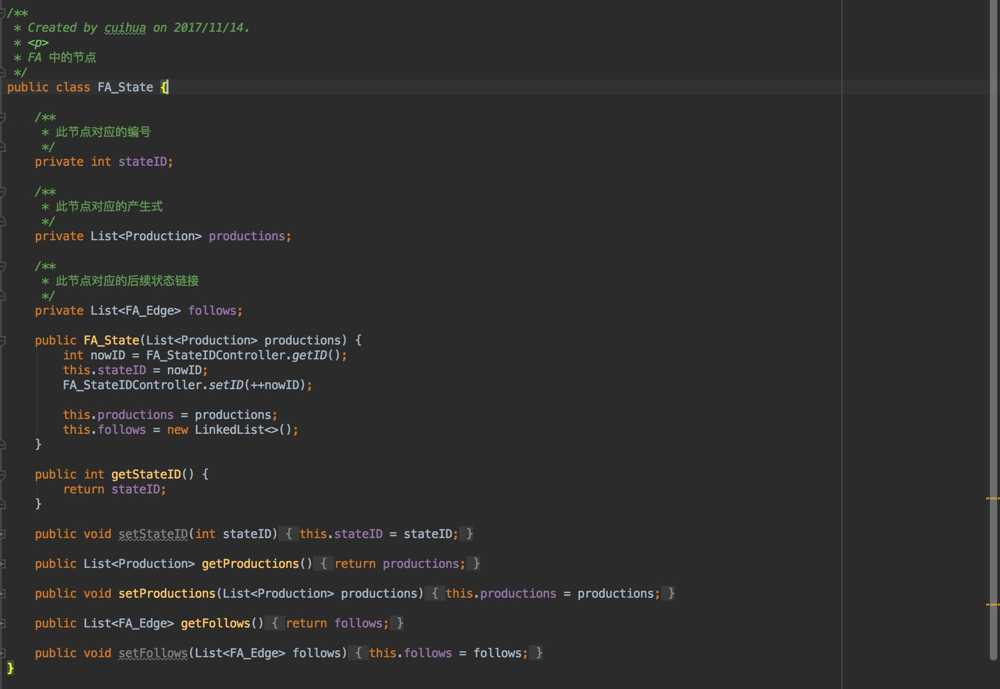
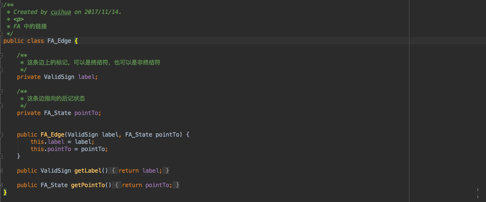

# 📝 SLR 的 Yacc 词法分析器

## Motivation / Aim
深入理解编译原理中文法分析的过程，通过实现 CFG 上下文无关文法 => Canonical LR(0) collection 规范 LR(0) 项集族 => Layered FA 分层的有穷自动机 => Parsing table 语法分析表的算法过程，生成 Yacc 中由 yacc_specification.y 文件生成的 PPT 语法分析表，再对输入的源程序／文本依次进行词法分析、文法分析，最终输出相应的归约序列。自动化构建 Yacc，深入理解各步转换的核心算法。

## Content description
在整个程序中，我是先从控制台获取用户输入，然后读取资源目录下定义正则定义的 regular_expression.l 文件，进行词法分析，获得输入的词法单元 Token 序列。再读取资源目录下定义正则定义的 yacc_specification.y 文件，构建规范 LR(0) 项集族，转换为有穷自动机，构建语法分析表 PPT 。将词法分析的 Token 序列识别为文法分析需要的输入终结符序列，依据 PPT 进行分析，输出文法的归约序列。

## Ideas / Methods
基于 Yacc 编程，通过定义自己的 Lex regular_expression.l 和 Yacc yacc_specification.y 文件，借用词法分析器，生成一个SLR / LR(0) 的语法分析表 PPT。

## Assumptions
1. 输入的需要分析的每一个词素使用空格隔开，所以源程序／文本中__不能含有空格__（引号中也不能出现空格）。一次输入只能包含 __1__ 条需要被归约的语句，输入结束后需要在空白符后输入 __###__ 结束输入，从而让程序运行。
2. 输入文本中支持的正则操作符有且只有 ___· | * + ? () {} [] , -___，如果需要匹配如上所述任一符号，需要在正则定义中对其进行转义。
  + 基本符号 __·__ （连接符） 可以输入，也可以不输入
  + __+__ 表示一次或多次，__?__ 表示0次或1次。
  + __{}__ 支持{n}、{m, n}、{m,}、{,n}四种形式，分别表示出现n次、出现m-n次、出现至少m次，出现至多n次。
  + __[]__ 支持[abc]简写或运算，也支持[a-zA-Z0-9]逻辑顺序连字符形式。
  + 转义使用 __\\__ 进行转义。比如需要匹配左大括号 { ，即需要在 RE 中写入 \\{
3. 输入对应的词法单元序列和结果归约序列会出现在控制台，归约序列也会出现在代码项目父目录下（与项目 Yacc 同级），命名为 `Yacc + 时间`。
4. regular_expression.l 中一行为一个模式-正则定义对，使用空格隔开。
5. yacc_specification.y 中一行只代表一个文法产生式，各终结符／非终结符间使用空格隔开。可以另起一行以 __|__ 开头，继续表示此非终结符可能的产生式。以 __;__ 对一个非终结符表示结束。
6. Yacc yacc_specification.y 文件中终结符只能输入 regular_expression.l 文件中输入的模式（如 id），不可以在 yacc_specification.y 文件中只匹配 id 特例比如 a ，除非在 regular_expression.l 文件中定义优先级更高的模式与对应正则定义，即新增 (aPattern, a)。
7. __*文法不支持 ε epsilon*__ 。
8. yacc_specification.y 文件除在 regular_expression.l 文件中出现的模式，其他字符均为非终结符。


## Related FA description
通过自定义资源目录下 regular_expression.l 中的正则定义和 yacc_specification.y 中的上下文无关文法，即可获取到对应的词法分析结果和文法分析结果，故没有一定的、确切的 FA 描述。


##	Description of important Data Structures
（Java 定义文件位于 /entities 和 /yacc/entities 和 /layeredFA/entities 下）

1. ValidSign：合法字符。非终结符 NonTerminal 和终结符 Terminal 的抽象父类，包含字符的表示形式。

  

2. Production：产生式。由一个非终结符作为左式，合法字符集合作为右式，并使用标记 indicator 标记小圆点的位置。

  

3. Action：文法分析表中 ACTION 子表的动作状态。包含动作类型和一个整数标记（移入的下一个状态／归约使用的产生式编号）
  

4. ParsingTable：文法分析表。包含 ACTION 子表和 GOTO 子表。
  

5. FA_State：FA 中的一个节点。包含编号、状态内部包含的所有产生式（闭包）和对后续状态的链接集合。
  

6. FA_Edge：FA 中的一条边／链接。包含边上的合法字符标记（终结符和非终结符都可以）、这条链接的后继状态。
  

## Description of core Algorithms

（Java 定义文件位于 /layeredFA 和 /yacc 下）

### 1. CFG 上下文无关文法 => Canonical LR(0) collection 规范 LR(0) 项集族
将 CFG 变为它的增广文法，增加新的开始符号和 0 号产生式，标记输入符号串被接受的状态。增加小圆点标记当前产生式／LR(0) 项。运用 closure 闭包算法进行 inner state extension 得到一个项集的闭包，运用 goto 算法进行 between state extension 得到规范 LR(0) 项集族。

### 2. Canonical LR(0) collection 规范 LR(0) 项集族 => Layered FA 分层的有穷自动机
根据构造的项集族，一个项集即为有限自动机的一个状态，between state extension 即为状态间的转换关系。

### 3. Layered FA 分层的有穷自动机 => Parsing table 语法分析表
根据构造的项集族，依次分析发出边，若标记是非终结符，则填入 PPT 的 GOTO 子表；若标记是终结符，则填入 PPT 的 ACTION 子表，状态为移入。再检查每一个状态是否含有可归约项，如果含有 A->∂· 可归约，那么计算 FOLLOW(A)，在结果终结符对应的 ACTION 子表中都放入归约式。

### 4. 根据 PPT 分析输入
新建两个栈，FA 的状态栈和输入的符号栈。压入起始状态 0 和起始符号 $ 。根据当前状态栈的栈顶状态和读头下的当前符号决定当前的动作（移入、归约、接受、错误）。若是移入，则压入该符号和对应的状态号；若是归约，则获得归约产生式，弹出右部符号，再压入左部符号，从 GOTO 子表中分析得到对应的跳转状态，压入；若是接受，则结束；若是错误／空，则抛出异常，此分析错误.

### 5. FIRST 和 FOLLOW

FIRST 是该符号可能推导出来的第一个符号的集合，若第一个是非终结符且可以推出空，那么需要计算后续符号，直至不能推出空或全都能推出空，将空加入 FIRST 集合。FOLLOW 是该符号后面可能出现的符号集合，若该符号无后续符号或后续符号能退出空，那么将产生式左部符号的 FOLLOW 加入该符号的 FOLLOW。FIRST 和 FOLLOW 的计算都可能出现循环，所以需要进行特殊处理，直至没有新的元素被加入计算的集合。

## Use cases on running
在满足 Assumptions 的前提下，可以任意修改资源文件目录下 regular_expression.l Lex 文件和 yacc_specification.y Yacc 文件，并在控制台输入与之对应的源程序／文本，与文件匹配。

### 测试用例一

regular_expression.l

```
testC c
testB b
testA a
```

yacc_specification.y

```
S : A B
    | testC
    ;

A : testA
    ;

B : testB S
    ;
```

输入 `a b a b c`，可以得到输出

```
-------------------
SHIFT 4
REDUCTION A -> testA 
SHIFT 6
SHIFT 4
REDUCTION A -> testA 
SHIFT 6
SHIFT 3
REDUCTION S -> testC 
REDUCTION B -> testB S 
REDUCTION S -> A B 
REDUCTION B -> testB S 
REDUCTION S -> A B 
ACCEPT
-------------------
```

### 测试用例二

regular_expression.l

```
addorminus \+|\-
multiply \*
divide /
leftParentheses \(
rightParentheses \)
id [a-z][_a-z0-9]*
```

yacc_specification.y

```
E : E addorminus T
    | T
    ;

T : T multiply F
    | F
    ;

F : leftParentheses E rightParentheses
    | id
    ;
```

输入 `a + b * ( c + d * e )`，可以得到输出

```
-------------------
SHIFT 5
REDUCTION F -> id 
REDUCTION T -> F 
REDUCTION E -> T 
SHIFT 6
SHIFT 5
REDUCTION F -> id 
REDUCTION T -> F 
SHIFT 7
SHIFT 4
SHIFT 5
REDUCTION F -> id 
REDUCTION T -> F 
REDUCTION E -> T 
SHIFT 6
SHIFT 5
REDUCTION F -> id 
REDUCTION T -> F 
SHIFT 7
SHIFT 5
REDUCTION F -> id 
REDUCTION T -> T multiply F 
REDUCTION E -> E addorminus T 
SHIFT 11
REDUCTION F -> leftParentheses E rightParentheses 
REDUCTION T -> T multiply F 
REDUCTION E -> E addorminus T 
ACCEPT
-------------------
```

### 测试用例三

regular_expression.l

```
testA a
```

yacc_specification.y

```
S : S A
    | A
    ;

A : testA
    ;
```

输入 ` a a a`，可以得到输出

```
-------------------
SHIFT 3
REDUCTION A -> testA 
REDUCTION S -> A 
SHIFT 3
REDUCTION A -> testA 
REDUCTION S -> S A 
SHIFT 3
REDUCTION A -> testA 
REDUCTION S -> S A 
ACCEPT
-------------------
```

### 测试用例四

regular_expression.l

```
i if
e else
normal a
separator \,|;
```

yacc_specification.y

```
S : i S e S
    | i S
    | S seperator S
    | a
    ;
```

输入 ` if a`，会抛出异常 `ParsingTableConflictException: SHIFT 7 和 REDUCTION 2发生了冲突`。

## Problems occurred and related solutions

1.  计算 FIRST 和 FOLLOW，虽然算法写的很简单，但是具体实现起来，因为「直至没有新元素被加入」，花了很多时间和精力来写。并且因为文法写法可能导致非终结符循环依赖的问题，需要对循环的非终结符进行延后处理，这一点也是实际处理过程中值得注意的。

2.  关于 Lex 和 Yacc 的连接交互。因为 Lex 生成的词法单元 Token 序列，而 Yacc 需要的却是终结符序列，最开始我认为二者并不是完全相等的，即文法产生式中可以出现正则定义的特例，比如我一定要在文法里面匹配正则定义 id 的 a，但是我发现这样做是前后矛盾的，因为经过词法分析器，输入已经变成了 Token 的模式，即通配，不能特例。所以后来经过与同学的探讨，我认为并定义文法 yacc_specification.y 中出现的非终结符都应该在 regular_expression.l 中定义，否则则认为它是一个非终结符号。


## Your feelings and comments
1. 有时候虽然理解了算法能够手动计算，但是实际用程序语言去实现仍然是一件有难度的事情。
2. 有的算法虽然看起来很简单，只有几行字，但是实现起来却是很难的。
3. 灵活使用各种数据结构，深入理解数据结构的内部实现，能够在一定程度上避免后续的编程错误，以便编出更健壮的代码。

## Highlights
1. 完整、合适的注释，详略得当，便于再次理解与修改，对算法中也别需要注意的点着重注释。
2. Maven 项目开发，使用 __log4j__ 进行日志记录输出，而不是简单的 System.out.print()。
3. 测试驱动编程。先根据情况写好测试用例，保证够狠地去进行测试。并通过测试各公开接口和使用反射测试私有方法，尽可能全面地覆盖各种情况。
4. 对输入的源程序／文本进行异常处理。如词法分析时，输入 (*a) 形式时会抛出异常 UnexpectedRegularExprRuleException，对输入的形式无法匹配 .l 文件中的正则定义时抛出异常 NotMatchingException；语法分析时，yacc_specification.y 中左部是 regular_expression.l 中定义的模式，即文法的非终结符时抛出异常 YaccFileInputException，当超出 SLR 的解决范围，产生移入-归约冲突、归约-归约冲突时抛出异常 ParsingTableConflictException，用 PPT 模拟时动作为 ERROR 时抛出异常 SyntaxException。
5. 实现了正则定义中的转义符号，从而匹配实践中的操作符。